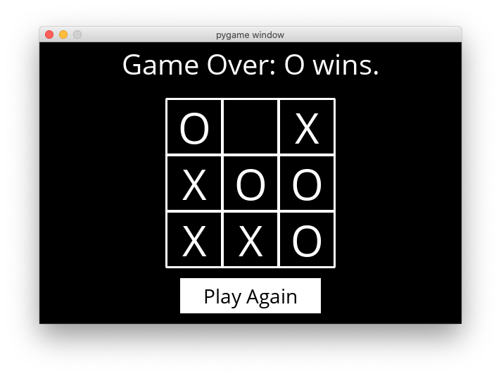

# Tic-Tac-Toe AI
Tic-Tac-Toe is also known as Xs and Os, and is a two player game. In this project, we build an AI to play as one player against a human player. The AI will find the most optimal move at each chance, looking at the current state of the board, and the different moves possible to reach the end. For this purpose, the first thing that may come to your mind is that the AI can look for _all_ the possible moves and their paths to the end, and then choose a path which may result in its victory. Again, this has to be done at every chance where the AI has to plan. It is obvious that this is not the right approach since the run-time of a single game will be huge! Thus, we will implement the MiniMax algorithm in Python, which is much more optimised. As an extra task, we can also implement Alpha-Beta pruning, which is an optimisation for the MiniMax alorithm, resulting in an even lower run-time at each step where the AI has to make a move. 


## Prerequisites
* ### MiniMax Algorithm and Alpha-Beta Pruning
You can learn about both the MiniMax algorithm and Alpha-Beta pruning **[here](https://github.com/wncc/algos-simplified/tree/master/MiniMax-Algorithm)**.
* ### Python
Even though you can implement the algorithm in any language, since the GUI of the AI is made in Python using PyGame, you will have to write your code in Python. You can learn to code in Python **[here](https://github.com/wncc/learners-space/tree/master/Python)**.

## Procedure
To get started, first execute ```pip3 install -r requirements.txt``` in your terminal to install PyGame. Even though you won't be needing PyGame for this project, it will be required to run the GUI for the game. 

Once you are familiar with the logic of the MiniMax algorithm, you need to implement it in Python. If you think about each step of the game and how it proceeds, you can see that the following functions need to be written: 
* ```initial_state```: returns the initial state of the board
* ```player```: return the player who has the next turn on the board
* ```actions```: return the set of possible actions available on a given board
* ```result```: returns the board that results from an _action_ on the board
* ```winner```: returns the winner of the game, if there is one
* ```terminal```: returns True if game is over, False otherwise
* ```utility```: returns 1 if X has won the game, -1 if O has won, 0 otherwise
* ```minimax```: returns the optimal action for the current player on the board

Now, remember that this is not the exhaustive list of functions that will be present in your program. You may need some additional functions to implement the ```minimax``` function above. You may also use more functions in order to make your code run. But that's up to you. Additionally, you can also implement Alpha-Beta pruning in your program, to make your AI even faster! To learn more about Alpha-Beta pruning, check out [this](https://www.youtube.com/watch?v=xBXHtz4Gbdo) vide.

Make sure to name your file as ```tictactoe.py``` since this will be imported by ```runner.py```, which contains the code for the GUI of the game written in PyGame. Don't worry, we will be provide you this file, along with other secondary files you need to run the program. To run your AI, make sure to execute the ```runner.py``` file only. 

Now you should be able to play against your AI. Your game should look like this:

